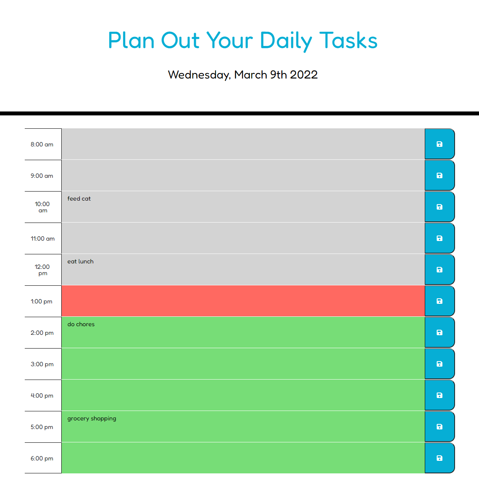

# Daily-planner
Daily planner is a simple calendar app that allows users to plan out daily events and tasks in order to stay organized. The time slots and color coding on the past, present, and future time slots allows users to stay efficient when planning during the day. 

## Technologies Used
HTML, CSS, and javascript were used to generate the app. Local storage is also used so that even when webpage is refreshed the saved tasks still remain.

## Future Implementations
Users will not only be able to store their plans for the day but will also be able to check off tasks that were finished and mark others with special comments, such as "to do" and "working on". This will help the user to be more aware of their current progress.

## Links
